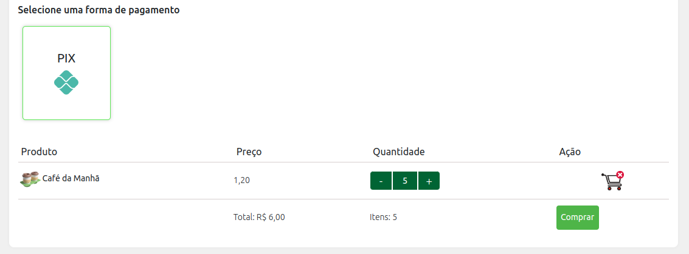
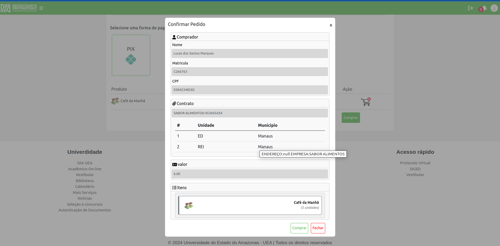
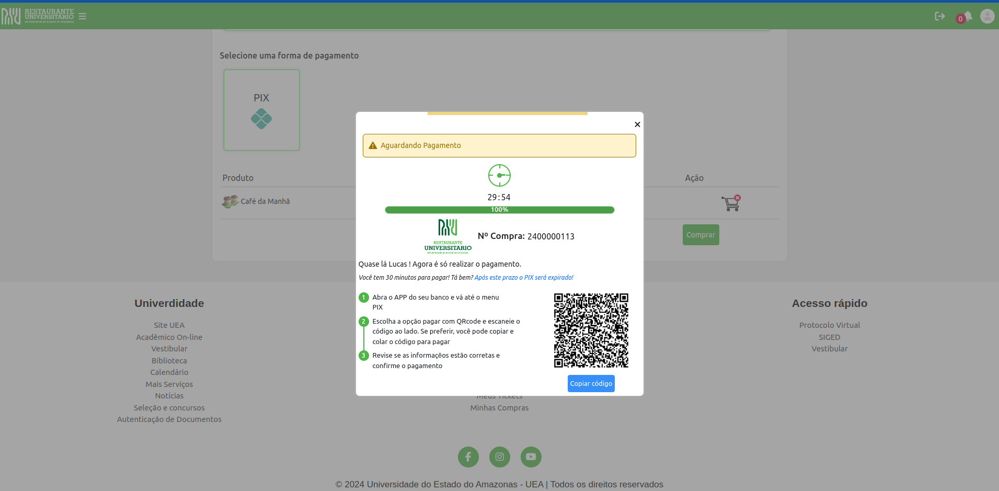
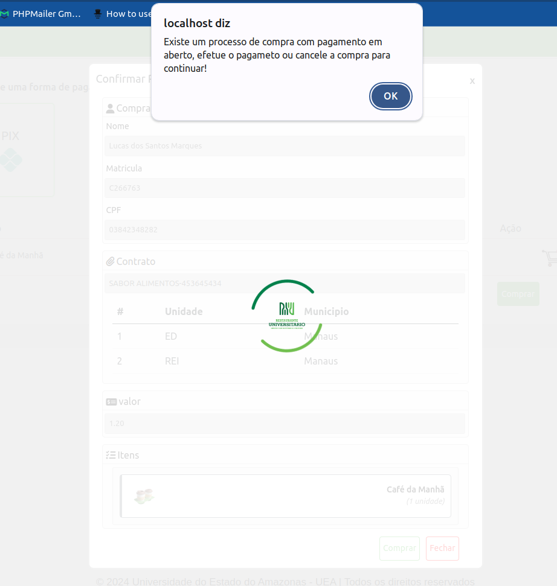

## Procedimento de Compra

### Requisitos

1. **Login**

O usuário deve estar **logado** para prosseguir para requisição do token

requisição:
```javascript
    const url = "https://api-carteira.uea.edu.br/ueaverify/login";

    const data_login = {
	    "email": "seu_email@uea.edu.br",
        "senha": "sua_senha"
    };

    const dados_user = await fetch(url,{
    method: 'POST',
    headers: {
        'Content-Type': 'application/json'
    },
    body: JSON.stringify(data_login)
    })
    .then(async (response)=>{
            const resposta = await response.json();
            return resposta;
    })

```

 Em caso de sucesso deve ser retornado para 

 ```json
 {
	"OBERON": {
		"usuario": {
			"USER_LDAP": "user",
			"ID_PESSOA": "id_pessoa",
			"CPF": "xxxxxxxxx",
			"PERFIL": "03",
			"PERFIL_NOME": "TÉCNICO",
			"ATIVO": "S",
			"SETOR": "1",
			"UNIDADE": "EAT",
			"DT_VALIDADE": null,
			"TOKEN": null,
			"MATRICULA": "Cxxxxx",
			"USU_ULT_ALT": "user",
			"IP": "187.27.128.44",
			"UNIDADE_ID": "19",
			"UNIDADE_SIGLA": "ESAT",
			"UNIDADE_NOME": "Escola Superior de Artes e Turismo",
			"DT_CRIACAO": "20-APR-11"
		},
		"status": true,
		"token": "A4MzYyNzk0LCJTdWIiOiJDMjY2NzYzIiwiRXhwIjoxNzA4NDQ5MTk0LCJOYW1lIjoibHNtYXJxdWVzIiwiVW5pZGFkZSI6IkVBVCIsIlBlcmZpbCI6IjAzIn0.vGGFY5f29RSE1_LGmWfNF9NSCQKFzktcm_CcMrB9tk0"
	}
}
 ```

2. **Token**

O usuário deve estar autenticado e possuir o token de acesso gerado em [https://api-carteira.uea.edu.br/ru/login]( https://api-carteira.uea.edu.br/ru/login "url login token")

requisição:

```javascript
  
  const url = "https://api-carteira.uea.edu.br/ru/login";
  
  const data_autenticacao = {
        "email": "seu_email@uea.edu.br",
        "senha": "sua_senha"
  }

  const token = await fetch(url,{
    method: 'POST',
    headers: {
        'Content-Type': 'application/json'
    },
    body: JSON.stringify(data_autenticacao)
  })
  .then(async (response)=>{
        const resposta = await response.json();
        return resposta;
  })

```


reposta:
```json
{
"token": "eyJ0eXAiOiJKV1QiLCJhbGciOiJIUzI1NiJ9pmG1rvvEbP16h2beHz5UbXtBa7ocl4Zq1U0HI"
}
```

### Interface de Compra


A interface de **compra de Ticktes** deve dar ao usuário as opções de:

1. Selecionar os **contratos ativos**

    **exemplo de requisição:**
   ```javascript
    const url = "https://api-carteira.uea.edu.br/ru/unidadecontrato/listar";

     const const unidades_contrato = await fetch(url,{
     method: 'GET',
     headers: {
        'Authorization': 'Bearer '+document.cookie.split('=')[1].split(';')[0]
     }
     })
     .then(async (response)=>{
        const resposta =  await response.json();
        return resposta;
     })

   ```

   **exemplo de resposta:**
    ```json
    [
        {
            "ID": "47",
            "UNIDADE_ID": "15",
            "UNIDADE_SIGLA": "ED",
            "UNIDADE_NOME": "Escola de Direito",
            "MUNICIPIO_ID": "1",
            "MUNICIPIO_NOME": "Manaus",
            "CONTRATO_ID": "39",
            "CONTRATO_EMPRESA": "5",
            "CONTRATO_EMPRESA_NOME": "SABOR ALIMENTOS",
            "CONTRATO_EMPRESA_CNPJ": "11862177000113",
            "CONTRATO_EMPRESA_RESPONSAVEL": "30",
            "CONTRATO_EMPRESA_FONE1": "92984315856",
            "CONTRATO_EMPRESA_FONE2": "92984315858",
            "CONTRATO_EMPRESA_EMAIL": "staff@example.com"
        },
        {
            "ID": "46",
            "UNIDADE_ID": "14",
            "UNIDADE_SIGLA": "REI",
            "UNIDADE_NOME": "Reitoria",
            "MUNICIPIO_ID": "1",
            "MUNICIPIO_NOME": "Manaus",
            "CONTRATO_ID": "39",
            "CONTRATO_EMPRESA": "5",
            "CONTRATO_EMPRESA_NOME": "SABOR ALIMENTOS",
            "CONTRATO_EMPRESA_CNPJ": "11862177000113",
            "CONTRATO_EMPRESA_RESPONSAVEL": "30",
            "CONTRATO_EMPRESA_FONE1": "92984315856",
            "CONTRATO_EMPRESA_FONE2": "92984315858",
            "CONTRATO_EMPRESA_EMAIL": "staff@example.com"
        }
    ]
   ```

2. Selecionar uma das **Unidades** do contrato selecionado
> É necessário listar para o usuário todas as unidades que o contrato contempla, mas o cliente precisa selecionar a **unidade que pretende consumir a refeição** 
 
> É importante que a aplicação guarde **id da unidade** selecionada pelo usuário para passar com um dos parâmetros na requisição de compra


3. Selecionar um dos **métodos de pagamento** disponíveis para aquela unidade no contrato selecionado

>É importante preservar o valor do **payment_method** pois será passado na requisição de compra para que o mercado pago retorne os itens necessários para a forma de escolhida  

**exemplo de requisição:**

 ```javascript
    const url = " https://api-carteira.uea.edu.br/ru/unidadecontrato/metodopagamento/contrato/{id_contra}/unidade/{id_unidade}";

     const const metodos_pagamento = await fetch(url,{
     method: 'GET',
     headers: {
        'Authorization': 'Bearer '+token 
        // 'Content-Type': 'application/x-www-form-urlencoded',
     }
     })
     .then(async (response)=>{
        const resposta =  await response.json();

        return resposta;
     })

```

**exemplo de resposta:**

```json
{
	"UNIDADE_ID": "6",
	"UNIDADE_SIGLA": "EAT",
	"FORMA_PAGAMENTO": {
		"payment_method": [
			"pix",
			"bolbradesco"
		]
	}
}
```


4. Selecionar **refeições** disponíveis para o contrato

**exemplo de requisição:**

 ```javascript
    const url = " https://api-carteira.uea.edu.br/ru/unidadecontrato/refeicao/contrato/{id_contrato}";

     const const refeicoes = await fetch(url,{
     method: 'GET',
     headers: {
        'Authorization': 'Bearer '+token 
        // 'Content-Type': 'application/x-www-form-urlencoded',
     }
     })
     .then(async (response)=>{
        const resposta =  await response.json();

        return resposta;
     })

```
**exemplo de resposta:**

```json
[
	{
		"ID_CONTRATO": "1",
		"ID_EMPRESA": "1",
		"EMPRESA": "UEA",
		"ID_REFEICAO": "1",
		"REFEICAO": "Café da Manhã",
		"VALOR": ",8"
	},
	{
		"ID_CONTRATO": "1",
		"ID_EMPRESA": "1",
		"EMPRESA": "UEA",
		"ID_REFEICAO": "2",
		"REFEICAO": "Almoço",
		"VALOR": "1,8"
	},
	{
		"ID_CONTRATO": "1",
		"ID_EMPRESA": "1",
		"EMPRESA": "UEA",
		"ID_REFEICAO": "3",
		"REFEICAO": "Lanche",
		"VALOR": ",8"
	}
]
```


5. Escolher a quantidade de itens de cada **refeição disponível**
 
 Neste passo a aplicação precisa lista as refeições, recebidas como resposta no item anterior, para que o usuário selecione a quantidade de tickts, de cada uma das refeições, que deseja comprarde.

 >É importante preservar o **nome** e **id** da refeicao



6. Checkout da tela de confirmação de compra 

Esta tela é necessária para que o usuário confirme todos os dados da compra.



7. Submeter o pedido de compra para a [api](https://api-carteira.uea.edu.br/ru/financas/mpcompra "end-point") 

Enviar requisição post com os dados do pedido para o end point [https://api-carteira.uea.edu.br/ru/financas/mpcompra
](https://api-carteira.uea.edu.br/ru/financas/mpcompra
)

O **JSON** esperado pela API é
```json
{
    "additional_info": {
        "items": [
            {
                "id": "id_refeicao",
                "title": "nome_refeicao",
                "description": "\"Tiket de Café da Manhã para uso no Restaurante Universitário UEA.\"",
                "picture_url": "http://172.16.45.131/ru/public/images/almoco_40.png",
                "category_id": "Comida Preparada",
                "quantity": 1,
                "unit_price": 1.2
            }
        ]
    },
    "description": "Pagamento de refeicao para uso no Restaurante Universitário UEA",
    "metadata": {
        "consumidor_id": "matricula_usuario",
        "consumidor_cpf": "cpf_usuario",
        "consumidor_tipo": "perfil_usuario",
        "id_contrato": "id_contrato",
        "id_unidade": "id_unidade"
    },
    "payer": {
        "email": "email_usuario@uea.edu.br",
        "first_name": "Nome do Usuário",
        "last_name": "Nome do Usuário",
        "identification": {
            "type": "CPF",
            "number": "cpf_usuário"
        }
    },
    "payment_method_id": "metodo_pagamento_escolhido",
    "transaction_amount": "1.20",
    "ip": "200.129.187.61",
    "dispositivo": 2
}
```

um **exemplo** de uso :
```json
{
    "additional_info": {
        "items": [
            {
                "id": 2,
                "title": "Almoço",
                "description": "\"Tiket de Almoço para uso no Restaurante Universitário UEA.\"",
                "picture_url": "http://172.16.45.131/ru/public/images/almoco_40.png",
                "category_id": "Comida Preparada",
                "quantity": 2,
                "unit_price": 1.8
            },
            {
                "id": 3,
                "title": "Lanche",
                "description": "\"Tiket de Lanche para uso no Restaurante Universitário UEA.\"",
                "picture_url": "http://172.16.45.131/ru/public/images/almoco_40.png",
                "category_id": "Comida Preparada",
                "quantity": 3,
                "unit_price": 1.8
            },
            {
                "id": 4,
                "title": "Jantar",
                "description": "\"Tiket de Jantar para uso no Restaurante Universitário UEA.\"",
                "picture_url": "http://172.16.45.131/ru/public/images/almoco_40.png",
                "category_id": "Comida Preparada",
                "quantity": 5,
                "unit_price": 1.8
            }
        ]
    },
    "description": "Pagamento de refeicao para uso no Restaurante Universitário UEA",
    "metadata": {
        "consumidor_id": "XXXXXXXXXX",
        "consumidor_cpf": "xxx.xxx.xxx-xx",
        "consumidor_tipo": "03",
        "id_contrato": "3",
        "id_unidade": "4"
    },
    "payer": {
        "email": "lsmarques@uea.edu.br",
        "first_name": "Lucas dos Santos Marques",
        "last_name": "Lucas dos Santos Marques",
        "identification": {
            "type": "CPF",
            "number": "xxx.xxx.xxx-xx"
        }
    },
    "payment_method_id": "pix",
    "transaction_amount": "18.00",
    "ip": "200.129.187.61",
    "dispositivo": 1
}
```

**exemplo de resposta de sucesso**

```json
{
    "message": {
        "external_reference": "2400000118",
        "date_created": "2024-02-19T16:54:52.122-04:00",
        "date_approved": null,
        "date_of_expiration": "2024-02-19T17:09:05.000-04:00",
        "time_expiration": "30",
        "additional_info": {
            "items": [
                [
                    {
                        "id": "2",
                        "title": "Almo\u00e7o",
                        "description": "\"Tiket de Almo\u00e7o para uso no Restaurante Universit\u00e1rio UEA.\"",
                        "picture_url": "http:\/\/172.16.45.131\/ru\/public\/images\/almoco_40.png",
                        "category_id": "Comida Preparada",
                        "quantity": "2",
                        "unit_price": "1.8"
                    },
                    {
                        "id": "3",
                        "title": "Lanche",
                        "description": "\"Tiket de Lanche para uso no Restaurante Universit\u00e1rio UEA.\"",
                        "picture_url": "http:\/\/172.16.45.131\/ru\/public\/images\/almoco_40.png",
                        "category_id": "Comida Preparada",
                        "quantity": "3",
                        "unit_price": "1.8"
                    },
                    {
                        "id": "4",
                        "title": "Jantar",
                        "description": "\"Tiket de Jantar para uso no Restaurante Universit\u00e1rio UEA.\"",
                        "picture_url": "http:\/\/172.16.45.131\/ru\/public\/images\/almoco_40.png",
                        "category_id": "Comida Preparada",
                        "quantity": "5",
                        "unit_price": "1.8"
                    }
                ]
            ]
        },
        "transaction_amount": 18,
        "qr_code": "00020126580014br.gov.bcb.pix0136b76aa9c2-2ec4-4110-954e-ebfe34f05b61520400005303986540518.005802BR5914AUeMVrY_UxShDA6006MatZus62230519mpqrinter13212587536304394B",
        "ticket_url": "https:\/\/www.mercadopago.com.br\/sandbox\/payments\/1321258753\/ticket?caller_id=1527092716&hash=ba0f8f4b-a6e6-49b8-b413-84dfd445ed28",
        "validade_ticket": null,
        "qr_code_base64": "iVBORw0KGgoAAAANSUhEUgAABWQAAAVkAQAAAAB79iscAAAI0UlEQVR42u3dWa4bNxAFUO6g97\/L3kEHQTxIrFt8MmIEMXn08WC5p9P6K9Q0nj\/ocw9aWlpaWlpaWlpaWlpaWlpaWlpaWlpaWlpaWlpaWlpaWlpaWlpaWlpaWlpaWlpaWlpaWlpa2t+vHfPn+vv\/rh8Hrh\/nXf9cOn4ene7y7ejPA\/f7Kdf7efV+E4OWlpaWlpaWlpaWlvYQ7fUasr3e5Ptjy7s0BybUzxcv7hG0iUFLS0tLS0tLS0tLS3uKtty93ri8xvSvt0jwG+\/+8VZvAWS54loyaGlpaWlpaWlpaWlpD9Wmf72Gg\/d7APkmy+m88Y5Pf2hpaWlpaWlpaWlpaWnngG9VL\/lKfvtMicLy9c4n09LS0tLS0tLS0tLSHqtte9ZyR1tTYVmiyNVrtJf9co0oLS0tLS0tLS0tLS3tn65tp5T8t3\/+7UwVWlpaWlpaWlpaWlraP1SbP2mo41WOtpHlNH2khI13DlI7Cy0tLS0tLS0tLS0t7d7a++uiyYk3jRtJYegI1ZlXeWR6v2V2j5aWlpaWlpaWlpaWdlNt+Vr\/7\/Xuo+uBm7atPe+FlKNMjywdd3WPGy0tLS0tLS0tLS0t7e7askCtBovt2usSd47FUrXpaW2g+eFMFVpaWlpaWlpaWlpa2l20ZTz\/k1dh58DwKunBstj6ztHmFMJOeFpaWlpaWlpaWlpa2uO00xLr5EldbvXZpd9t+twl5AzpPFpaWlpaWlpaWlpa2oO06aqUfsvnXcH4lBn97Xq1UtSZ34+WlpaWlpaWlpaWlnZ77dTM9lWEN3I6r4SIaUDJk7et\/UoUSUtLS0tLS0tLS0tLu5V2SrolWUrdlT626bwRZkvWtrvpQHl7WlpaWlpaWlpaWlraU7RfXVUb5vJU\/1Vh5iJSvcp0FFpaWlpaWlpaWlpa2sO0U\/da2lWdw8Y6oCRn92qfXbn9R1WXtLS0tLS0tLS0tLS0+2lL+q2JE6eAL8WOJSCdlgHUPdfprT6sEaWlpaWlpaWlpaWlpd1Fu+iBS9P6R8jzpQa3L+f2p6UBtLS0tLS0tLS0tLS0J2qnZ5fqx\/qI9JKLG0yLrduazI+qLmlpaWlpaWlpaWlpaffTlla3t+VrKSW36IYb3dCSK\/wsqSVufFkjSktLS0tLS0tLS0tLu5s2bz178njH8pKr5dnl2qbjrr0zLS0tLS0tLS0tLS3tOdqUoSt1lanWMhVNPu9Vl0\/pn1vUZH4URdLS0tLS0tLS0tLS0m6lnT5rVNvRNqUCc8ZvlTyc0n60tLS0tLS0tLS0tLSHafONUyavToqcyjZzJPiUVQFpzMmHOwhoaWlpaWlpaWlpaWl31qZiyNF\/6viS9AYp2ZfXsOWfipaWlpaWlpaWlpaWdm9tm29L6bdpYXX7xBE635psYYosv5geSUtLS0tLS0tLS0tLu5E2VUnmKfwpf9eOkHy6Ldgjv31+OC0tLS0tLS0tLS0t7RHaKVf3dMWVtYZyeqEp\/lvsXRulOa4ElQ8tLS0tLS0tLS0tLe0h2rKXOi1aa7vh6rzJVJs5RZv5DeofWlpaWlpaWlpaWlraQ7RPjgQXQeWVQ8RUSJnD1ab97ZMokpaWlpaWlpaWlpaWdj9tWzmZpkLe5WGLqsuEarZgp6CSlpaWlpaWlpaWlpb2JO0TaijT8JBR3qCEjXe3CnsKIGsUmYJPWlpaWlpaWlpaWlra\/bUNNGfjnjxlMk8kuTIgve6HU0poaWlpaWlpaWlpaWn306aMWg74njxlsuwBaALIXGE5nZx2ZNPS0tLS0tLS0tLS0h6hHbnVLc8waUeajHByU6KZyzav0l1HS0tLS0tLS0tLS0u7v3Y6+BR8rpy8c4auiwRrNeVU8rm4lpaWlpaWlpaWlpaWdmftFErmdrV1cm6q3XwWkWW537pik5aWlpaWlpaWlpaW9gjtahPaRE4dciXQnHrg7lCn2ZycfhZaWlpaWlpaWlpaWtrdta9ptQaaB0KmGsqmkDLLru6nuuYEIC0tLS0tLS0tLS0t7d7aaUrJ\/Z5lmxrcRlmlVoLPUd4v5Q1TkFp+EVpaWlpaWlpaWlpa2gO0bfVj3rE23uO\/J8w1efK4yHZldr7BRUtLS0tLS0tLS0tLe5I210s+3ViSOss\/\/6tGoK8xZk0ZllQgLS0tLS0tLS0tLS3tAdoyMqTm4NopJYsrru7aKficXuiKewVoaWlpaWlpaWlpaWn31qbZjSMMLWl46dmlG+4u5ZgJ33XX0dLS0tLS0tLS0tLS7qxtE2zt13XXXLm2SeKVX+TDqktaWlpaWlpaWlpaWtr9tHdI3V1d+q3WVb6S60D\/dL\/pkbkBj5aWlpaWlpaWlpaW9hxtLb0sB568pjotxS5JwTKjf6RplHllNi0tLS0tLS0tLS0t7RHaOuOx4O88bqTk71LZZv06\/UApu9dXXdLS0tLS0tLS0tLS0u6nfcK0x\/q1ZOOa\/dUpC7iuumwfREtLS0tLS0tLS0tLe4S2ZNTuxa7qZQ6uydqlBzVHS0BKS0tLS0tLS0tLS0t7jnbkKY45ErxzR1uJCa+FIuX+PtxBQEtLS0tLS0tLS0tLu5U2fdrV1VOD27QPu3TNNTf9xWtpaWlpaWlpaWlpaWn31rbVj4v+tCevuE6zIEsU2cyMbOdI0tLS0tLS0tLS0tLS7q+9FrHeFNyl9NsiOhx5jXbCfxxF0tLS0tLS0tLS0tLSbqlNpZKl\/nJ0cySv7Jm66\/LP8kEIS0tLS0tLS0tLS0tLe6I2AZ4wyOTOpyyKNe\/Fu3yY3aOlpaWlpaWlpaWlpT1A2+DTouySABwlsTcBUqDZZgtpaWlpaWlpaWlpaWmP0LZVlyHVNtotaq9f77Lx+rXg8i7TKBODlpaWlpaWlpaWlpb2EG0tfEwPS6g0zWQqn0xNb8Ez0jI3WlpaWlpaWlpaWlraI7T\/\/w8tLS0tLS0tLS0tLS0tLS0tLS0tLS0tLS0tLS0tLS0tLS0tLS0tLS0tLS0tLS0tLS0tLS0t7W\/T\/gV1ftTIZyHlZwAAAABJRU5ErkJggg=="
    },
    "status": true
}
```

**exemplo de erro**

```json
{
    "message": "Existe um processo de compra com pagamento em aberto, efetue o pagameto ou cancele a compra para continuar!",
    "status": false
}
```

7. Notificar o usuário sobre o processamento da requisição (sucesso ou falha)

 Em caso de **sucesso** apresentar para o usuário:
 * Número de compra para UEA (**external_reference**)
 * Tempo de expiração do pagamento (**time_expiration**)
 * Qrcode gerado pelo mercado pago (**qr_code_base64**)
 * Codigo copia e cola (**qr_code**)




 Em caso de **erro** apresentar para o usuário o motivo do erro 


